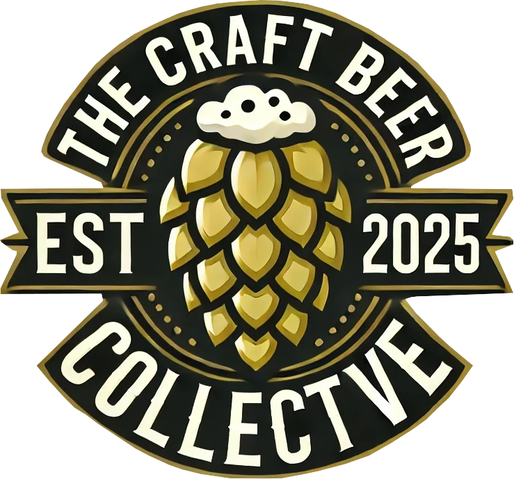
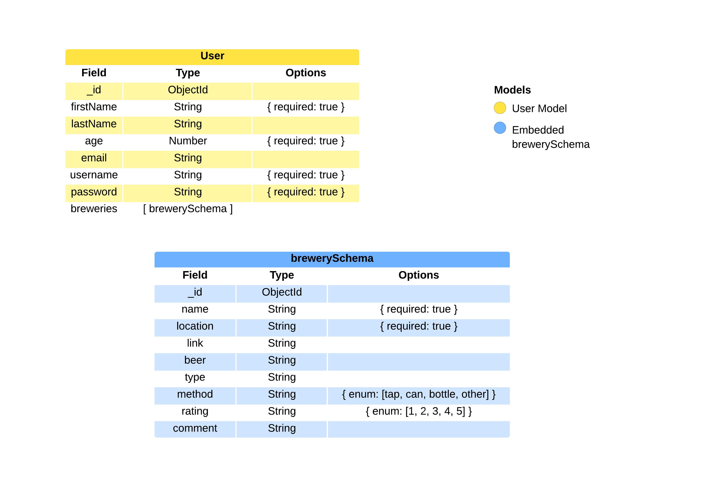

  

<h2 align="center">🍺 Welcome to The Craft Beer Collectve 🍺</h2>

It’s time to crack open a cold one and vibe with the best craft beer community on earth. Whether you’re chasing those dank IPAs, mellow stouts, or some funky sour brews, you’re in the right place. Start your journey here:

https://the-craft-beer-collective-30d7183bcd5d.herokuapp.com/

## Deployment Versions
<h3 align="center">Desktop</h3>

<h3 align="center">Mobile</h3>

<h3 align="center">ERD</h3>

<h3 align="center">Wireframe</h3>

## Attributions
The Craft Beer logo was made by ChatGPT and modified using GIMP

## Technologies
<h3 align="left">Languages and Tools:</h3>

<!-- 
 
  
  
  
  
  
 
 -->

## Future Enhancement
- Community chat feature
- Added details
- Check in feature