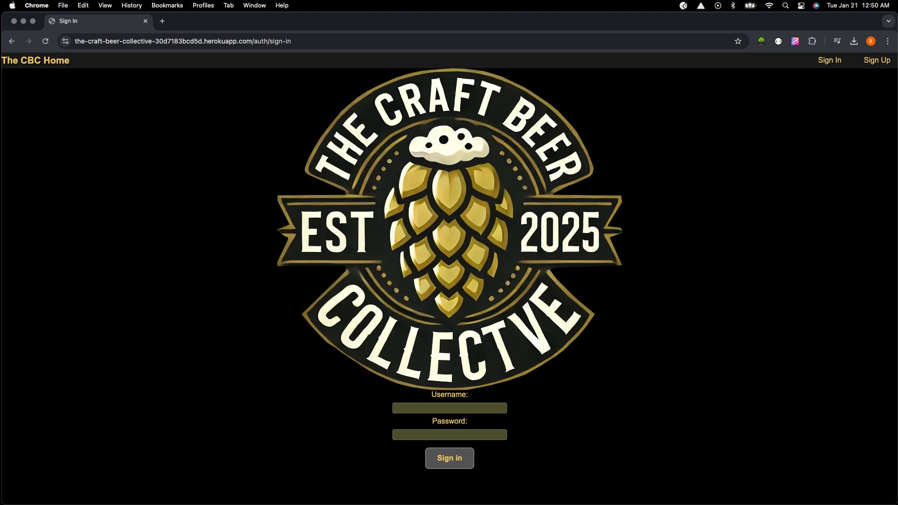

  

<h2 align="center">🍺 Welcome to The Craft Beer Collectve 🍺</h2>

Here we have an app designed to bring craft beer enthusiasts together! This app allows users to build their own personalized craft beer database, logging and organizing their favorite brews. Users can also share their discoveries with the entire community aka "The Collectve", creating a vibrant space to connect, explore, and celebrate the art of craft beer. Whether you're a seasoned aficionado or a curious newcomer, The Craft Beer Collective is your gateway to the world of craft beer. You can start your journey here:

https://the-craft-beer-collective-30d7183bcd5d.herokuapp.com/

## Deployment Versions
<h3 align="center">Desktop</h3>

    

<h3 align="center">Mobile</h3>

    
    

## Planning Tools

<h3 align="center">ERD</h3>

<h3 align="center">Wireframe</h3>

## Attributions
The Craft Beer logo was made by ChatGPT and modified using GIMP

## Technologies
<h3 align="left">Languages and Tools:</h3>

## Future Enhancement
- Community chat feature
- Added details (ABV, IBU's)
- Check in feature